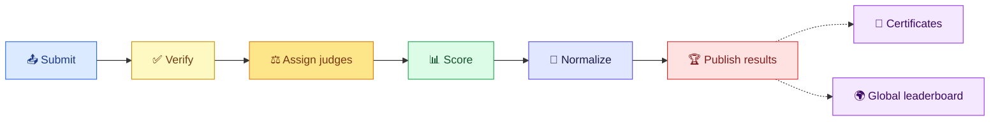
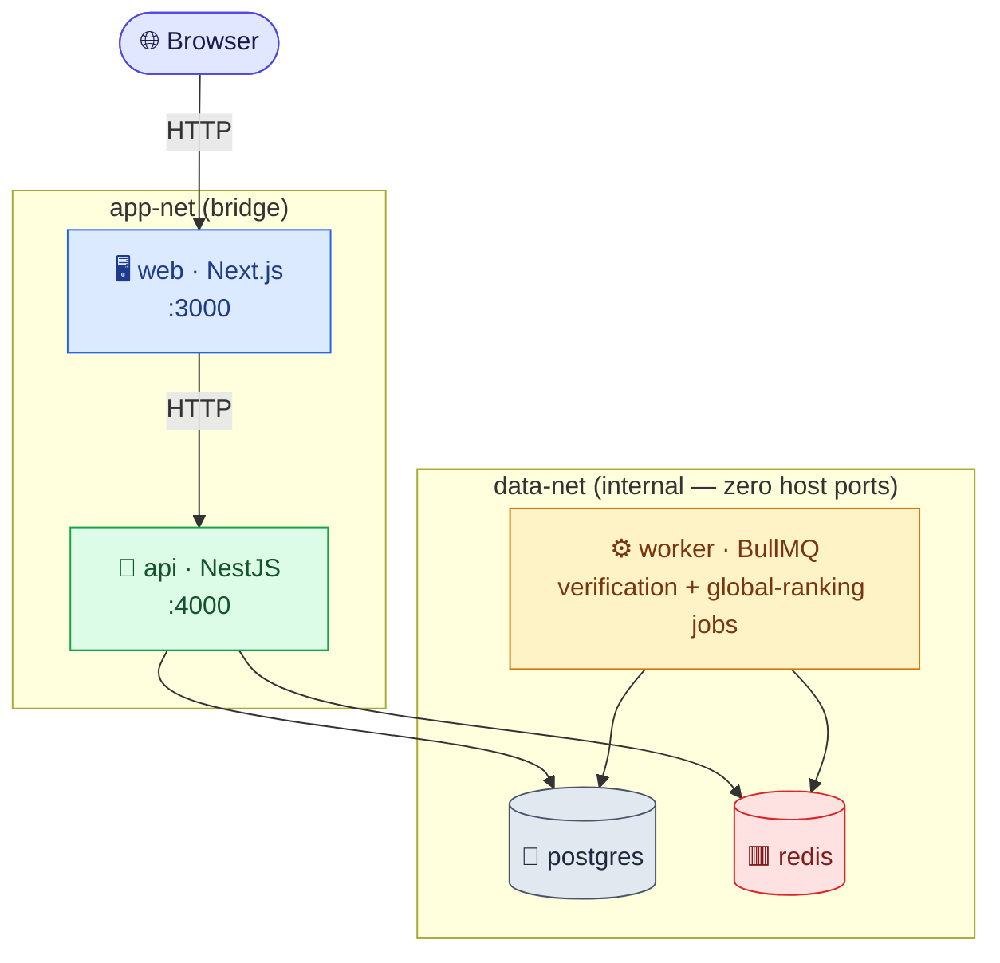

<div align="center">

# 🦖 Raptor

**A self-hostable, open-source hackathon submission & judging platform —
built backend-first, so role isolation and deadlines are never
optional.**

[](LICENSE)


</div>

Raptor runs an entire hackathon lifecycle — registration, team
formation, submissions, automated verification, judge assignment,
weighted+bonus scoring, cross-judge normalization, dense-rank results
with genuine tie-sharing, public voting, signed certificates, comments,
and a platform-wide leaderboard — on infrastructure an organizer
actually controls. `docker compose up` and there is no cloud database,
no auth-as-a-service, no hosted CAPTCHA, no third-party mail API to
sign up for: just Postgres, Redis, and this code, all self-hosted.

> 📐 **This README is the "how do I run it" doc.** For the exact
> scoring/normalization/ranking math (the part a skeptical judge would
> want to verify line by line), see **[JUDGING.md](JUDGING.md)**. For
> system architecture and the full data model, see
> **[docs/ARCHITECTURE.md](docs/ARCHITECTURE.md)** and
> **[docs/DATA-MODEL.md](docs/DATA-MODEL.md)**.



---

## 📑 Table of Contents

1. [Prerequisites](#-prerequisites)
2. [Quickstart](#-quickstart)
3. [First steps after boot](#-first-steps-after-boot)
4. [Configuration & secrets](#-configuration--secrets)
5. [Demo environment](#-demo-environment)
6. [Running the acceptance checker](#-running-the-acceptance-checker)
7. [Running the test suite](#-running-the-test-suite)
8. [Tiers claimed](#-tiers-claimed)
9. [Bonus challenges](#-bonus-challenges)
10. [What's included](#-whats-included)
11. [Architecture summary](#-architecture-summary)
12. [Project structure](#-project-structure)
13. [Troubleshooting](#-troubleshooting)
14. [Documentation map](#-documentation-map)
15. [License](#-license)

---

## ✅ Prerequisites

| Requirement | Why |
|---|---|
| **Docker Engine** + **Docker Compose v2** (`docker compose`, not the old `docker-compose`) | Everything runs in containers — you don't need Node, Postgres, or Redis installed locally to run Raptor |
| A shell that can run `openssl` (any Linux/macOS/WSL shell; Git Bash on Windows works) | Needed once, to generate secret files |
| ~2 GB free disk, any modern x86_64/arm64 host | Postgres + Redis + 3 app containers |

Optional, **only** if you want to develop outside Docker:

| Requirement | Why |
|---|---|
| Node.js ≥ 22 | Matches `engines.node` in `package.json` |
| pnpm 9.15.0 (`packageManager` pin) | Monorepo workspace manager |
| A local Postgres instance | See [Local development](#local-development-without-docker) below |

---

## 🚀 Quickstart

```bash
git clone <this-repo-url>
cd dogfood

# 1. Generate the 5 required secret files (Docker Compose secrets — see
#    the Configuration section below for exactly what each one is)
cp secrets/smtp_credentials.txt.example secrets/smtp_credentials.txt
openssl rand -hex 32 > secrets/postgres_password.txt
openssl rand -hex 32 > secrets/app_secret.txt
openssl rand -hex 32 > secrets/github_token_key.txt

# certificate_signing_key needs a real Ed25519 key, not a hex string —
# generate it using the api image itself, no local Node required:
docker compose build api
docker compose run --rm api node dist/scripts/generate-certificate-signing-key.js \
  > secrets/certificate_signing_key.txt

# 2. Boot everything
docker compose up --build
```

That's it. On first boot, the `api` container automatically:

- runs all Prisma migrations against a fresh Postgres,
- imports the committed `fixtures.json` (real organizer-supplied
  fixture data — 8 tracks, 30 judges, 40 teams, 41 project entries
  collapsing to 40 submissions, 126 scores) idempotently, and
- writes the acceptance-checker's `[checker.auth_headers]` values to
  `apps/api/.fixture-auth-headers.txt` inside the container (and to
  stdout — watch the `api` logs on first boot).

| Service | URL | Notes |
|---|---|---|
| 🖥️ Web app | http://localhost:3000 | Next.js frontend |
| 🔌 API | http://localhost:4000 | NestJS backend |
| 🩺 Health check | http://localhost:4000/health | Used by Docker's own healthcheck |

Postgres and Redis publish **no host ports at all** — they're only
reachable from `api`/`worker` over an internal Docker network, by
design (see [Architecture](#-architecture-summary)).

To stop everything: `docker compose down` (add `-v` only if you
intentionally want to wipe the database volume).

### Local development (without Docker)

```bash
createuser -h localhost -p 5433 -U postgres --login --pwprompt raptor
createdb   -h localhost -p 5433 -U postgres --owner=raptor raptor

cp apps/api/.env.example apps/api/.env   # fill in your own DB password
pnpm install
pnpm --filter @raptor/api exec prisma migrate dev
pnpm --filter @raptor/api dev            # terminal 1
pnpm --filter @raptor/web dev            # terminal 2
```

Local dev deliberately uses port **5433** for Postgres, not 5432 — so
it never collides with anything else on your machine, and is never
confused with the separate, non-host-published instance Docker Compose
manages.

---

## 🧭 First steps after boot

1. Open http://localhost:3000 — you'll land on the **public events
   list**, viewable with no login (this is intentional — Module 3/5's
   public-by-default gallery design).
2. The fixture import (see above) has already seeded one full,
   real event with 40 submissions across the judging pipeline. Browse
   its public gallery, open a submission, read its comments.
3. To act as staff (organizer/judge/admin), use the seed-time
   auth-header bootstrap instead of registering by hand: the four
   `Cookie: raptor_session=...` values printed by the `api` container
   on boot (and written to `apps/api/.fixture-auth-headers.txt`) log
   you straight in as the fixture organizer, two fixture judges, and a
   fixture participant — paste one into your browser's dev tools as a
   cookie, or pass it as a header with `curl`.
4. Want a full, click-through demo instead of raw fixture data? See the
   [Demo environment](#-demo-environment) section — it seeds four
   events, one at each stage of the lifecycle (draft, running, open
   voting, fully archived-with-certificates), so you can see every
   phase without waiting for real deadlines to pass.
5. Try the [acceptance checker](#-running-the-acceptance-checker) next
   — it's the fastest way to see the whole judging pipeline (submit →
   verify → assign → score → results → CSV export) exercised in one
   pass.

---

## 🔐 Configuration & secrets

Raptor **never** takes a secret as a plain environment variable in
`docker-compose.yml` — all five are Docker Compose
[secrets](https://docs.docker.com/compose/use-secrets/), mounted
read-only at `/run/secrets/*` and read from there at container startup.
Templates live in `secrets/*.txt.example`; the real `*.txt` files are
gitignored and must be generated per-deployment.

| Secret file | Used by | How to generate | Required for |
|---|---|---|---|
| `postgres_password.txt` | postgres, api, worker | `openssl rand -hex 32 > secrets/postgres_password.txt` | Everything — Postgres won't start without it |
| `app_secret.txt` | api | `openssl rand -hex 32 > secrets/app_secret.txt` | Keyed-hashing of `Session.ipHash`; without it, IP hashing is simply skipped (not insecurely stored — just off) |
| `github_token_key.txt` | api, worker | `openssl rand -hex 32 > secrets/github_token_key.txt` | AES-256-GCM key for encrypting an admin-supplied GitHub token (Module 6, verification) |
| `smtp_credentials.txt` | api | Copy `secrets/smtp_credentials.txt.example`, fill in real SMTP host/user/password | Sending real verification/invitation emails. With `TEST_MODE=true` (never use in production) the token is logged instead, so this can stay as placeholder values for local dev |
| `certificate_signing_key.txt` | api | **Not** `openssl rand` — needs a real Ed25519 keypair. Run: `docker compose run --rm api node dist/scripts/generate-certificate-signing-key.js > secrets/certificate_signing_key.txt` | Signing/verifying certificates (Module 12). Nothing else in the platform depends on it |

**Non-secret configuration** lives in plain environment variables —
see `.env.example` (root, for non-Docker local dev) and the
`environment:` blocks in `docker-compose.yml` (for the real Docker
path). The one flag worth knowing about explicitly:

> ⚠️ **`TEST_MODE`** — logs email verification tokens to stdout instead
> of sending real email. Off by default. Has exactly one call site in
> the codebase. **Never enable this in a real production deployment** —
> see `docs/stages/01-auth-and-email-setup.md` Section 5.

### 🔒 Production hardening

A few settings default to values convenient for the acceptance checker
and local evaluation, and are meant to be tightened for a real,
public-facing deployment:

| Setting | Default | For production |
|---|---|---|
| `FIXTURES_IMPORT` | `true` | Set `false` once you don't need the checker's seeded fixture event/credentials — see [`THREAT-MODEL.md`](THREAT-MODEL.md) limit 5.7 |
| `COOKIE_SECURE` | off | Set `true` once TLS actually terminates in front of the API — turning it on without real TLS breaks login, since browsers won't send a `Secure` cookie back over plain HTTP |
| `LOGIN_RATE_LIMIT_ATTEMPTS` / `LOGIN_RATE_LIMIT_WINDOW_MINUTES` | `10` / `15` | Tune to taste — generic 429, never reveals whether an email is registered |
| `GALLERY_RATE_LIMIT_PER_MINUTE` | `120` | Generous by default so it never affects real users or the acceptance checker; lower it if you see scraping |

Full detail on each: `apps/api/.env.example`.

---

## 🎭 Demo environment

*Full spec: `docs/design/20-demo-environment.md`*

Fixture data (above) is realistic but static and organizer-supplied —
it's not designed for a stranger to click through and *feel* what
running an event across its full lifecycle looks like. `DEMO_MODE`
solves that:

```bash
DEMO_MODE=true docker compose up --build
```

With this flag set (must match on **both** `api` and `worker` — the
compose file already wires this automatically via one shared
`${DEMO_MODE}` variable), the stack:

- connects to a **completely separate database** (`raptor_demo`
  instead of `raptor`) — your real event data, if any, is never
  touched, under any circumstance, while this flag is on;
- creates that database if it doesn't exist yet;
- seeds **four events**, one at each meaningful lifecycle stage, so
  you can see every phase without waiting for a real deadline:

| Demo event | Phase | What it shows |
|---|---|---|
| 🌱 `demo-draft` | Draft / not yet open | What an organizer sees before anything is public |
| 🏃 `demo-running` | Submissions open, judging in progress | Live team/submission/scoring flow |
| 🗳️ `demo-voting` | Voting round open | Public ballot + shortlist (tallies intentionally hidden while the round is open — Module 11's own rule, not a bug) |
| 🏆 `demo-archived` | Fully complete | Published results with a genuine tied 1st place, closed voting with a declared winner, real Ed25519-signed certificates |

- runs the unconditional fixture import (above) on top, and triggers a
  real global-ranking recompute so the leaderboard reflects the demo
  events too.

Turn it off by simply omitting `DEMO_MODE` (or setting it `false`) —
the stack falls back to the ordinary `raptor` database, unaffected by
anything demo mode ever wrote.

Check which mode is active at any time: `GET /config/public` →
`{"demoMode": true|false}`.

---

## 🧪 Running the acceptance checker

Raptor ships `.dogfood.toml` — a config file describing exactly how the
organizers' own `run.py` acceptance checker should connect to a live
instance: base URL, the five mechanical-check routes, and pre-captured
session-cookie auth headers for the fixture organizer/judges/
participant (captured automatically at seed time, so the checker never
needs to perform its own login flow).

```bash
docker compose up --build     # boot the stack, let fixtures import

# apps/api/.fixture-auth-headers.txt now has 4 real Cookie: lines —
# copy them into .dogfood.toml's [checker.auth_headers] block if the
# organizers' checker reads that file directly, or hand the file to
# their run.py per whatever invocation they specify.
```

The routes and auth headers already committed in `.dogfood.toml` are
**real, live-verified values** against the actual committed
`fixtures.json` (not placeholders) — re-generate them only if you reset
the database or swap in a different `fixtures.json` (see
`.dogfood.toml`'s own `[checker.regenerate]` section for the exact
3-step procedure).

---

## ✅ Running the test suite

```bash
# From repo root, against the api workspace:
pnpm --filter @raptor/api exec jest

# Or, if you're already inside apps/api:
cd apps/api && npx jest
```

This runs the full backend unit/integration suite (Jest + ts-jest) —
every module's stage doc ends with a "What I'm testing for this
module" section, and that list is the actual minimum test set enforced
here, not a suggestion. Deadline/timestamp-boundary logic is always
tested by manipulating fixture timestamps into the past/future, never
by waiting on real wall-clock time.

---

## 🏅 Tiers claimed

Per `.dogfood.toml` — **flipped to `true` only once a tier's acceptance
checks have actually passed against the organizers' own `run.py`, never
claimed ahead of that.** The real `run.py` has now been run against a
live-booted instance and the real committed `fixtures.json` — not just
our own reproduction of equivalent checks — and every check passed:

```
$ python run.py .dogfood.toml --fixtures apps/api/prisma/fixtures.json

T1  gallery is public ................. PASS
T1  project from fixtures shown ....... PASS
T1  closed event refuses submissions .. PASS
T2  judge sees own scores ............. PASS
T2  judge cannot see peer scores ...... PASS
T2  participant blocked ............... PASS
T2  csv export works .................. PASS

claimed T1 T2, verified T1 T2
```

```toml
t1_core     = true   # confirmed by the real run.py
t2_judging  = true   # confirmed by the real run.py
t3_public   = false  # awaiting human-judge review — outside run.py's scope
t4_stretch  = false  # awaiting human-judge review — outside run.py's scope
```

The full, unedited transcript is committed at
[`acceptance-report.txt`](acceptance-report.txt). T3 (voting,
certificates, comments, global ranking) and T4 (stretch) are marked
pending in `.dogfood.toml` — both tiers are real and implemented (see
[What's included](#-whats-included)); the organizers' own checker is
scoped to T1/T2 by design, so per the brief, T3/T4 verification is a
human-judge call (docs, code, demo video) rather than something any
automated script covers. See `.dogfood.toml` itself for the full
evidence trail — the brief's own rubric rewards exactly this kind of
precise, evidence-backed claim, so this file is written as a receipt.

---

## 🎁 Bonus challenges

Optional, worth nothing to the score directly (`stages/23-bonus-challenges.md`
Section 1) — they only break ties and feed a separate prize. Same
honesty bar as tiers: a status is never rounded up. Four-value
vocabulary (`stages/23-bonus-challenges.md` Section 2): **Claimed**
(fully done and verified) → **Documented, unverified** (doc exists,
something in it hasn't been checked, or one "done when" item is still
outstanding) → **Designed, not built** (a spec exists; nothing runs) →
**Not attempted**.

| Bonus | Status | Where |
|---|---|---|
| 🛡️ Threat Model | **Claimed** | [`THREAT-MODEL.md`](THREAT-MODEL.md) |
| 📐 Normalization Proof | **Claimed** | [`NORMALIZATION.md`](NORMALIZATION.md) |
| 🔌 API First | **Designed, not built** — a deliberate scope choice | [`API.md`](API.md) |
| ⚖️ Pairwise Judging Mode | **Designed, not built** — a deliberate scope choice | [`stages/22-pairwise-mode.md`](stages/22-pairwise-mode.md) |

**Threat Model** covers the five abuse classes the brief names (Sybil
votes, ballot stuffing, submission scraping, judge collusion, deadline
gaming) and states plainly where its coverage ends. Every control it
claims has been checked directly against the running code — which
timestamp verification reads, whether the gallery/login are
rate-limited, whether fixture import can be disabled, real
session-cookie attributes — fully closed out.

**Normalization Proof** re-implements the normalization method
independently and runs it against the real fixture data — surfacing a
real fix along the way: the fixture importer now builds judge
calibration profiles on import, so judges correctly split 22-real/
8-fallback, matching the data exactly. Re-verified to match the
independent script's numbers precisely. The project owner decided to
keep the current z-score method as-is rather than build an
evaluated-but-unimplemented joint-model upgrade — its advantage exists
only in simulation, against a method that's built, tested, and now
live-verified — so the sparse-data characteristic of small events stays
clearly documented (`NORMALIZATION.md`, `JUDGING.md` Section 5.4) as a
known operating condition, not engineered around.

**API First** and **Pairwise Judging Mode** are both real, substantial
second efforts (a generated OpenAPI contract with drift tests; a whole
second judging pipeline), intentionally scoped for later. The
organizers' own advice is to do fewer bonuses properly rather than
sample all four (`stages/23-bonus-challenges.md` Section 1); with two
already `Claimed`, the project owner chose depth over breadth.

> 🐍 **Running the bonus scripts yourself** (`scripts/normalization-proof.py`,
> `scripts/bradley-terry-reference.py`) needs `numpy` —
> `pip install -r scripts/requirements.txt` first. This is separate
> from the acceptance checker (`run.py`), which needs only the Python
> standard library and nothing else.

---

## 🧩 What's included

Everything below is **implemented and tested** — backend routes with
full unit/integration coverage, and a built frontend screen for
everything participant/organizer/judge-facing. Full behavioral specs
live in [`stages/`](stages/) and [`docs/design/`](docs/design/) if you
want the exact rules behind any of it — code is always kept in sync
with those, never the reverse.

| Area | What it does |
|---|---|
| 🔑 **Accounts & roles** | Signup, email verification, argon2-hashed passwords, hashed session tokens. Site-admin staff accounts; per-event judge/organizer invitations with accept/decline |
| 📅 **Event management** | Full event lifecycle (draft → running → judging → results → archived), phase-aware deadline validation, public events list + detail page |
| 👥 **Teams** | Create/join a team via invite link, roster management, kick a member, roster locks permanently once a team submits |
| 📤 **Submissions** | Draft → submit → unlimited resubmit until the deadline, public searchable/filterable gallery |
| ✅ **Automated verification** | Async check against a submitted repo, organizer approve/disqualify gate before anything reaches a judge |
| ⚖️ **Judge assignment** | Manual or algorithmic assignment, per-judge caps (with override), no-show reassignment — locks permanently to a judge the moment they submit a score |
| 📊 **Scoring** | Organizer-defined weighted rubric + optional bonus tracks + special-award nominations, unlimited resubmission with a full, immutable revision history |
| 📐 **Normalization** | Cross-judge z-score calibration so one harsh or generous judge can't skew results, with a fallback for new judges and a permanent lock the moment results go live |
| 🏆 **Results & rankings** | Dense ranking where genuine ties *share* a place (never an arbitrary tiebreak), draft → publish workflow, fully audited post-publish corrections |
| 🗳️ **Public voting** | Single-choice audience ballot, self-hosted CAPTCHA/proof-of-work anti-abuse, curated shortlist, results hidden until a round closes |
| 📜 **Certificates** | Cryptographically signed (Ed25519) participation/winner certificates, verifiable independently, public certificate gallery |
| 💬 **Comments** | Sanitized, threaded discussion on public submissions |
| 🌍 **Global leaderboard** | Platform-wide ranking across every event a person has competed in, with its own tie-break rules and a per-person history drill-down |
| 🖥️ **Organizer dashboard** | One unified admin shell tying together event setup, verification, assignment, scoring oversight, results publishing, CSV export, and a per-event audit-log viewer |
| 🎭 **Demo mode** | One flag spins up a fully isolated sandbox database with four sample events spanning the whole lifecycle — see [Demo environment](#-demo-environment) |

---

## 🏗️ Architecture summary



`web` has no network path to `postgres`/`redis` at all — the diagram's
missing arrow is a structural guarantee, not an omission. Every
privileged action still passes through `api`'s own guards regardless.

- **`api`** — NestJS backend, the only service `web` ever talks to.
  Every privileged/scoped check (`@RequireEventRole(...)`, resolved
  per-request from the path's `eventId` — there is no global "is this
  user an organizer" check anywhere) lives here, server-side, never
  trusted from the client.
- **`web`** — Next.js frontend. Purely a client of `api` over HTTP —
  never touches Postgres or Redis directly.
- **`worker`** — a separate BullMQ consumer process for anything
  async/slow: submission verification checks (Module 6) and
  global-ranking recomputes (Module 14). Runs against the same Redis
  instance as `api`'s rate limiter and queues, on a queue-name contract
  the two processes share but never directly import from each other.
- **`postgres`** / **`redis`** — internal-network-only, **zero
  published host ports**, ever, under any configuration. The only way
  to reach them is through `api`/`worker`.

Full detail (network model, tech-stack rationale, deployment topology):
[`docs/ARCHITECTURE.md`](docs/ARCHITECTURE.md).

---

## 📁 Project structure

```
dogfood/
├── apps/
│   ├── api/            NestJS backend — one module per stage doc
│   │   ├── src/
│   │   │   ├── auth/, roles/, events/, teams/, submissions/, ...
│   │   │   ├── scoring/, normalization/, results/, voting/,
│   │   │   ├── certificates/, comments/, global-ranking/
│   │   │   ├── queues/         BullMQ producers (api side)
│   │   │   └── scripts/        seed.ts, seed-demo.ts, fixtures-import.ts, ...
│   │   └── prisma/             schema.prisma + fixtures.json
│   ├── web/             Next.js frontend
│   │   ├── app/                route-based pages
│   │   ├── components/         hand-built UI kit, no external design system
│   │   └── lib/api.ts          typed api client
│   └── worker/           BullMQ consumer — verification + global-ranking jobs
├── packages/
│   ├── shared/           Types/DTOs shared between api and web
│   └── crypto/           Shared crypto helpers (e.g. GitHub token encryption)
├── docs/
│   ├── ARCHITECTURE.md   System shape, tech stack, network model
│   ├── DATA-MODEL.md     Full schema, field-by-field, with rationale
│   ├── DECISIONS.md      Chronological decision log — the "why"
│   ├── GLOSSARY.md       Precise project terminology
│   └── design/           Frontend module docs (screens/states/errors) + Modules 15–21
├── stages/                Backend module specs (01–14) — source of truth for behavior
├── secrets/               *.txt.example templates; real *.txt gitignored
├── docker-compose.yml     Full multi-container topology
├── .dogfood.toml          Tier claims + acceptance-checker connection config
├── JUDGING.md             Exact scoring/normalization/ranking math
└── README.md              You are here
```

---

## 🛠️ Troubleshooting

<details>
<summary><strong>Container <code>api</code> restarts once, then comes up fine</strong></summary>

On a cold `docker compose up`, Postgres briefly reports "the database
system is starting up" during its own crash-recovery replay — the
`api` container's healthcheck-gated `depends_on` should already prevent
`api` from racing this, but if you're on an old checkout without that
fix, `restart: unless-stopped` retries it successfully within a few
seconds regardless — your data stays fully intact throughout.

</details>

<details>
<summary><strong><code>bind source path does not exist: .../secrets/*.txt</code></strong></summary>

You haven't generated the real secret files yet — only the
`.txt.example` templates are committed. See
[Configuration & secrets](#-configuration--secrets) above for the exact
generation command for each of the 5 files.
</details>

<details>
<summary><strong><code>GET /config/public</code> shows <code>{"demoMode": false}</code> after setting <code>DEMO_MODE=true</code></strong></summary>

Either the variable wasn't actually exported on the `up` command, or an
already-running container wasn't recreated to pick up the new
environment. Fix:

```bash
docker compose down
DEMO_MODE=true docker compose up --build --force-recreate
```

Verify inside the running container: `docker compose exec api env | grep DEMO_MODE`.

</details>

<details>
<summary><strong>Port 3000 / 4000 already in use on the host</strong></summary>

Something else on your machine is bound to those ports. Either stop it,
or edit the `ports:` mappings in `docker-compose.yml` for `web`/`api`
(left side only — the right side is the container's internal port and
should stay as-is).

</details>

<details>
<summary><strong>Local (non-Docker) dev: Prisma client errors after a fresh <code>pnpm install</code></strong></summary>

`pnpm install`'s automatic `prisma generate` postinstall step can fail
to find the schema in a monorepo layout. Fix explicitly:

```bash
pnpm --filter @raptor/api exec prisma generate
```

</details>

<details>
<summary><strong>I don't see fixture data (or demo data) in the gallery</strong></summary>

The fixture importer runs unconditionally on every boot,
against whichever database is currently active — the real `raptor` DB
normally, or `raptor_demo` if `DEMO_MODE=true`. Check the `api`
container's boot logs for `[fixtures-import]` / `[seed-demo]` lines to
confirm it actually ran and against which database; `FixtureImportRecord`
makes re-imports idempotent, so re-running `docker compose up` never
duplicates data.

</details>

---

## 🗺️ Documentation map

| Doc | What's in it |
|---|---|
| [`JUDGING.md`](JUDGING.md) | The exact scoring, normalization, and ranking math — for anyone verifying fairness/correctness |
| [`docs/ARCHITECTURE.md`](docs/ARCHITECTURE.md) | System shape, tech stack, network topology, deployment model |
| [`docs/DATA-MODEL.md`](docs/DATA-MODEL.md) | Full Prisma schema, field-by-field, with the reasoning behind each design choice |
| [`docs/DECISIONS.md`](docs/DECISIONS.md) | Chronological log of every non-obvious design decision and why it was made |
| [`docs/GLOSSARY.md`](docs/GLOSSARY.md) | Precise project terminology — read before using any project-specific term |
| [`stages/`](stages/) | One locked spec per backend module (01–14), plus Pairwise Mode (22) and the bonus-challenge rules (23) |
| [`docs/design/`](docs/design/) | Frontend screen-by-screen specs, plus Modules 15–21 (organizer shell, fixtures, demo mode, this README) |
| [`THREAT-MODEL.md`](THREAT-MODEL.md) | Bonus: what attacks this platform stops, and the honest limits of that coverage |
| [`NORMALIZATION.md`](NORMALIZATION.md) | Bonus: an independent re-derivation of the normalization math, run against real fixture data |
| [`API.md`](API.md) | Bonus: the API-first contract, and current status of the OpenAPI/drift-testing layer |
| [`CLAUDE.md`](CLAUDE.md) | Engineering principles and conventions for anyone (human or AI) developing this repo |

---

## 📄 License

Apache-2.0 — see [`LICENSE`](LICENSE).
